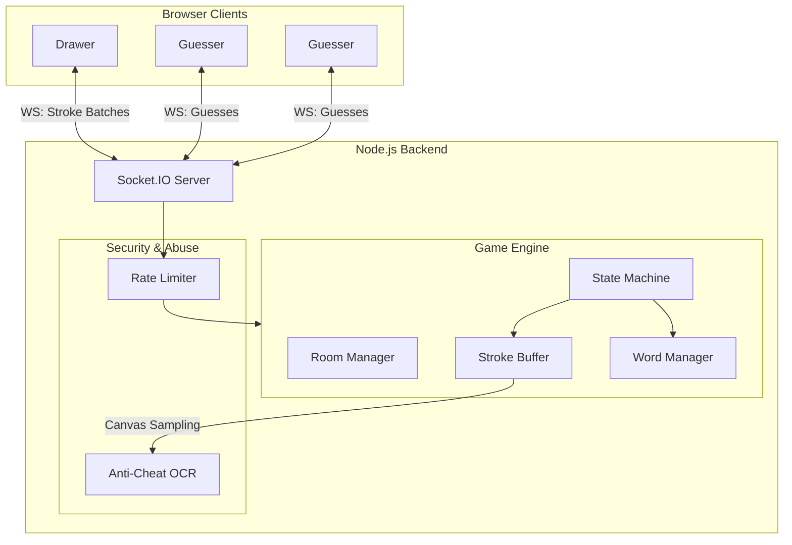
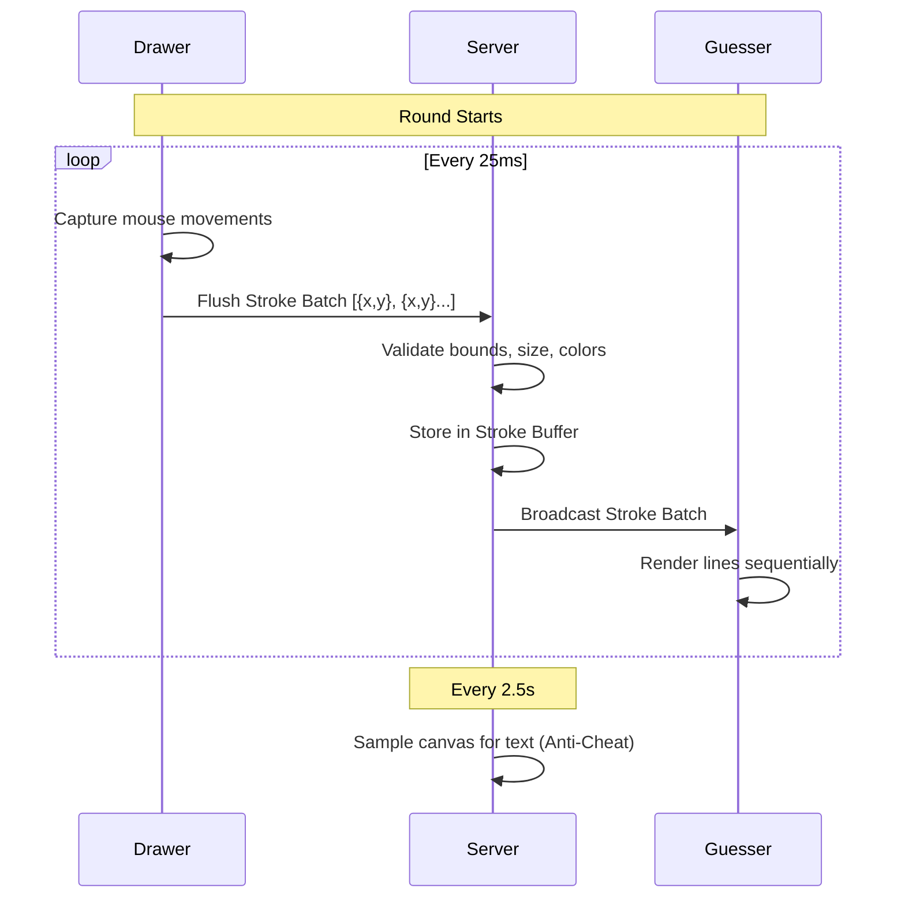

<div align="center">
  <h1>🎨 Drawly</h1>
  <p><strong>A Real-Time Multiplayer Drawing & Guessing Game</strong></p>
  <p>Built with Node.js, Express, Socket.IO 4, and HTML5 Canvas</p>
</div>

---

## 🌟 Overview
Drawly is a highly scalable, real-time multiplayer Pictionary-style game. Players can create rooms, invite friends via links, and take turns drawing and guessing secret words. The server acts as the absolute authority, managing game state, round timing, scoring, and even employing a **machine-learning Anti-Cheat system (OCR)** to catch drawers who try to cheat by writing the word.

## 🚀 Quick Start

1. **Navigate to the project folder:**
   ```bash
   cd Q1
   ```
2. **Install dependencies:**
   ```bash
   npm install
   ```
3. **Start the server:**
   ```bash
   npm start
   ```
   > **Changing the Port:**
   > - **Bash/Zsh:** `PORT=4000 npm start`
   > - **PowerShell:** `$env:PORT=4000; npm start`
   > - **Command Prompt (CMD):** `set PORT=4000 && npm start`

### Environment Variables
| Variable | Default | Description |
|----------|---------|-------------|
| `PORT` | `3000` | The port the server listens on. |
| `HOST` | `0.0.0.0` | The host interface to bind to. |
| `MAX_ROOMS` | `2000` | Maximum number of concurrent rooms allowed. |
| `ANTI_CHEAT` | `true` | Set to `"off"` or `"false"` to disable OCR-based anti-cheat. |
| `OCR_LANG_PATH` | *undefined* | Path to local `eng.traineddata` (defaults to Tesseract CDN if unset). Start from `Q1/` so it finds the local file. |

## 🧪 Testing

Drawly includes an automated test suite covering core game logic (like Levenshtein distance guess checking and sliding-window rate limiters). The tests use Node's built-in `node:test` runner.

To run the tests:
```bash
npm test
```
The test suite ensures that exact matches, case-insensitivity, near-misses, and chat/stroke rate limits function securely without regressions.

## 🎮 How to Play

1. **Create a Room:** Enter your name, choose the number of rounds, set the draw time, and pick a **Word Category** (General, Hard, Animals, Food, Movies) or provide custom words.
2. **Invite Friends:** Copy the generated invite link from the Waiting Room and send it to your friends.
3. **Start the Game:** Once at least 2 players are in the room, the host can start the game.
4. **Gameplay:** 
   - **Drawer:** Selects from 3 word choices and draws on the canvas using the Pen, Eraser, or Fill tools.
   - **Guessers:** Type guesses into the chat. The faster you guess, the more points you earn.
5. **Winning:** The player with the most points at the end of all rounds wins!

## ⚙️ Architecture & Scalability

Drawly is designed as a robust, event-driven system prioritizing low-latency real-time data flow, state consistency, and fail-safe recovery.

### System Architecture Diagram



### Important Concepts: WebSockets & Syncing

Drawly relies heavily on **WebSockets (via Socket.IO)** instead of traditional HTTP requests. Unlike HTTP where the client must constantly "ask" the server for updates, WebSockets maintain a persistent, bidirectional connection. This allows the server to immediately push new drawings to guessers the millisecond it receives them.

#### The Syncing Loop (Sequence Diagram)
To ensure the game feels smooth and responsive without overwhelming the server, Drawly uses a **batched syncing strategy**.



### Real-Time Canvas Synchronization
Drawing is captured as **live point batches**. Every 25ms, the client flushes these batches to the server. The server sanitizes the data (clamping coordinates, verifying colors, checking sizes) and relays it to all guessers. 
- **Zero visible lag:** Remote canvases render the strokes progressively, making the drawing appear exactly as the drawer moves their mouse.
- **Mid-Round Joining:** A `StrokeBuffer` stores the history of the current turn, allowing late joiners or reconnecting players to instantly see the complete canvas upon joining.
- **Memory Caps:** The buffer enforces hard limits (e.g., 3,000 strokes max) to ensure malicious users cannot OOM (Out-Of-Memory) the server.

### Server-Authoritative State & Security
- **State Machine:** The server dictates all state transitions (`LOBBY` -> `PICKING_WORD` -> `DRAWING` -> `ROUND_END`). Clients cannot manipulate timers or game progression.
- **Secret Words:** The secret word is **never** sent to guessers, preventing client-side scraping.
- **Scoring:** The server calculates all points based on round elapsed time. Guessers get points based on speed; the drawer receives **75% of the average points** awarded to the guessers for that round.
- **Reconnection Grace Period:** If a player drops connection or refreshes, they are kept in the room for **30 seconds**. Upon reconnecting with their session token, their socket mapping is seamlessly swapped, preserving their score and seat.

### Anti-Cheat System (OCR) 🛡️
To prevent the drawer from simply writing the word on the canvas, Drawly features a hybrid heuristic-OCR pipeline:
1. **Heuristics:** A fast, bounding-box based filter (`heuristic.js`) checks if drawn strokes resemble handwriting before invoking heavy processing.
2. **Pure-JS Rasterizer:** A custom `renderer.js` module renders vector strokes into a binary PBM (Portable Bitmap) image on the server.
3. **Tesseract.js OCR:** The image is scanned by Tesseract. The detected text is cross-referenced with the secret word using a Levenshtein fuzzy match. It requires an OCR confidence score of at least 35 (`minConfidence`) to ignore noise. *Note: OCR uses the committed `eng.traineddata` from the working directory, so start the server from `Q1/` (or set `OCR_LANG_PATH`).*
4. **Penalties:** 
   - **Strike 1:** The drawer's canvas is wiped and they receive a warning.
   - **Strike 2:** The canvas is wiped and a -50 point penalty is applied.
   - **Strike 3:** The drawer forfeits their turn entirely.
   
*(Known Trade-off: Sloppy handwriting or near-miss OCR outputs may not be caught if they fall below the 80% similarity threshold or the 35% confidence threshold. Very short words under 4 characters require an exact match.)*

## 📊 Performance Testing

The project includes an automated load testing script to measure capacity. Because the OCR Anti-Cheat system uses WebAssembly workers (which are highly CPU-intensive), capacity depends heavily on the server's CPU.

To run the load test:
```bash
node scripts/loadtest.js --url http://localhost:3000 --max 100 --ramp 8
```

### Load Test Results (Approximate)
*Results depend heavily on CPU capability (measured on an i7-12700H, 16 GB RAM).*

| Condition | Max Rooms | Max Sockets | CPU% | RSS MB | p50 ms | p99 ms |
|-----------|----------:|------------:|-----:|-------:|-------:|-------:|
| **Anti-Cheat ON** | ~5-10 | ~15-30 | ~98 | ~130 | ~15ms | ~50ms |
| **Anti-Cheat OFF** | ~100-200 | ~300-600 | ~90 | ~180 | ~5ms | ~40ms |

> **Note:** With the Anti-Cheat system fully active, Tesseract OCR consumes massive CPU analyzing strokes on the main thread, limiting a single Node instance to around 5-10 highly active concurrent rooms before the event-loop p99 latency breaches 50ms. With `ANTI_CHEAT=off`, it handles roughly 100-200 rooms on a shared 1-vCPU machine.

## 📂 Project Structure

```
├── server/
│   ├── index.js           # Express + Socket.IO server entrypoint
│   ├── roomManager.js     # Room CRUD & player management (30s reconnect grace)
│   ├── gameEngine.js      # Turn state machine & server-authoritative scoring
│   ├── wordManager.js     # Word selection & progressive hints
│   ├── guessChecker.js    # Levenshtein answer validation & near-miss logic
│   ├── strokeBuffer.js    # Live-segment buffer, undo, and replay capabilities
│   ├── rateLimiter.js     # Chat + stroke rate limits & size caps
│   ├── config.js          # Centralized configuration and tuning parameters
│   ├── antiCheat/         # OCR-based anti-cheat system
│   │   ├── index.js       # Orchestrator and penalty logic
│   │   ├── heuristic.js   # Fast bounding-box check for text-like strokes
│   │   ├── renderer.js    # Pure-JS stroke to PBM image rasterizer
│   │   └── ocrWorker.js   # Tesseract.js wrapper
│   └── words.json         # Categorized word lists
├── public/
│   ├── index.html         # Single-page application UI
│   ├── css/style.css      # Dark glassmorphism design system
│   └── js/
│       ├── app.js         # Client orchestrator & session management
│       ├── canvas.js      # Drawing engine (live streaming at 25 ms flush)
│       ├── chat.js        # Chat system & guess inputs
│       ├── game.js        # Game state UI updates
│       ├── lobby.js       # Room creation/joining interface
│       └── replay.js      # End-of-game stroke replay engine
├── scripts/
│   └── loadtest.js        # Capacity measurement script
├── package.json
└── README.md
```

## 🛠️ Tech Stack

| Layer | Technology |
|-------|-----------|
| **Backend** | Node.js + Express |
| **Real-time Transport** | Socket.IO 4 (WebSocket) |
| **Frontend** | Vanilla HTML5 / CSS3 / JavaScript |
| **Graphics** | HTML5 `<canvas>` API |
| **Machine Learning** | Tesseract.js (OCR) |
