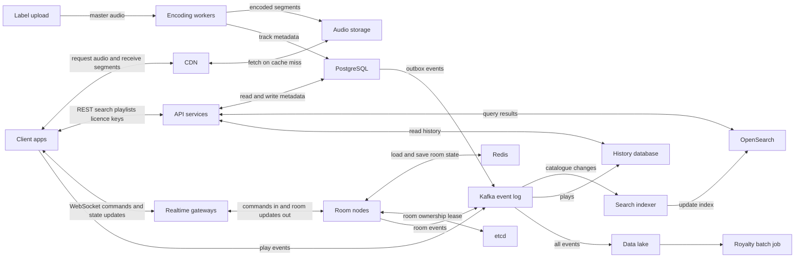
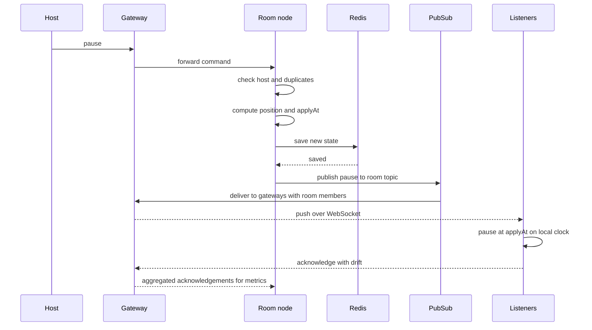

# Music Streaming with "Listen Together" Rooms: System Design

## 1. The scenario

We are building a Spotify-style music service with one special feature: **Listen Together rooms**. A user creates a room and shares a link. Everyone who joins hears the same track at the same moment. Anyone can add songs to a shared queue and vote to skip. Only the host can pause or seek, and that applies to the whole room.

**Scale to design for**

| Item | Number |
| --- | --- |
| Monthly users | 20 million |
| Listening at the same time (peak) | 2 million |
| Songs in the catalogue | 50 million |
| Open rooms at peak | 200,000 (2 to 5,000 listeners each) |

**The two hard problems**

1. **Moving audio to millions of people cheaply and quickly.** 2M (2 million) listeners at about 160 kbps (kilobits per second) is roughly **320 Gbps (gigabits per second)**. No single server can do that, so audio must come from a CDN (Content Delivery Network).
2. **Keeping a room in sync within \~200 ms (milliseconds, thousandths of a second).** Different phones, networks and clocks must all play the same second of the same song.

**Core idea:** keep these two problems separate. Audio travels through the CDN. The room service only sends tiny messages saying *what to play and when*. If the room service fails, the music keeps playing.

## 2. Concepts you need (and how we use each)

| Concept | Plain meaning | In this project |
| --- | --- | --- |
| **Object storage** | Cheap, huge file storage (like Amazon S3, Simple Storage Service) | Holds all encoded audio files (\~0.9 petabytes for 50M tracks) |
| **Encoding (transcoding)** | Converting a master recording into compressed formats | Each track is encoded at several quality levels (24, 96, 160, 320 kbps) |
| **Segmenting** | Cutting audio into small chunks (\~5 s) | Lets players start fast, seek anywhere, and switch quality mid-song |
| **CDN (Content Delivery Network)** | Servers worldwide that cache files near the listener | Delivers the audio. Popular songs are served from nearby edge servers |
| **Adaptive bitrate (ABR)** | The player picks quality based on current network speed | A slow network drops to 96 kbps instead of stopping |
| **Caching** | Keeping hot data close and fast | CDN for audio, Redis for popular searches and room state |
| **WebSocket** | A permanent two-way connection | Carries room commands and updates in real time |
| **Clock synchronisation** | Estimating the difference between a phone's clock and the server's | The foundation of in-sync playback |
| **Pub/Sub (Publish/Subscribe)** | Publish one message and every subscriber receives it | One pause command fans out to thousands of listeners |
| **Lease and fencing** | A time-limited claim that only one node owns a room, with a counter that blocks old owners | Prevents two servers controlling the same room |
| **Event streaming (Kafka)** | A durable, ordered log of everything that happened. Kafka is the tool we use for it | Feeds search, analytics and royalty calculations |
| **SLI / SLO (Service Level Indicator / Objective)** | An SLI is a measurement; an SLO is the target for it | "95% of listeners within 200 ms of the room" |
| **API / REST** | An API (Application Programming Interface) is how apps talk to a service. REST (Representational State Transfer) is a common style that uses ordinary web requests | Clients use REST for search, playlists and creating or joining rooms |
| **CMAF (Common Media Application Format)** | A standard way to package audio and video into small chunks that work with the main streaming protocols | Our \~5 second audio segments |
| **DRM (Digital Rights Management)** | Encryption so only authorised users can play protected content | Segments are encrypted; the licence service gives keys only to valid subscribers |
| **Inverted index** | Like the index at the back of a book: it maps words to the items that contain them | How OpenSearch finds tracks instantly as you type |
| **Outbox pattern** | When data changes, save the change **and** a "to be published" event in the same database transaction. A background worker later sends the event on | Keeps Postgres and search consistent without losing updates (see section 5) |
| **Percentiles (p50, p95, p99)** | p95 means 95% of values are at or below this number, so it shows the bad-but-common experience, not just the average | Used for drift and latency metrics |

## 3. Architecture

**How to read it (two-way arrows mean data is both sent and fetched):**

- **Upload to playback (audio):** a label uploads a master, the encoding workers write segments to storage and metadata to PostgreSQL. When a listener plays, the client asks the CDN, and the CDN fetches from storage only on a cache miss, then returns the segments to the client.
- **Browse and search (read and write):** the client calls the API services, which read and write PostgreSQL, query OpenSearch for search results, and read listening history.
- **Rooms (live, both directions):** the client sends commands over the WebSocket and receives state updates back. The room nodes load and save state in Redis and hold the room lease in etcd.
- **Events (one direction, feeding everything else):** play events, room events and catalogue changes (via the outbox) go into Kafka. From there the search indexer updates OpenSearch, history is stored, and the data lake feeds the royalty batch job.

## 4. Audio delivery

**Storage and encoding.** Labels upload lossless masters. Encoding workers convert each into Opus/AAC (two audio compression formats; AAC stands for Advanced Audio Coding) at four quality levels and cut them into \~5 second **CMAF (Common Media Application Format) segments**, then save them in object storage. Total: \~18 MB (megabytes) per track, \~0.9 PB (petabytes) overall. *Rejected: one big file per track.* It is simple, but makes quality switching and seeking inefficient.

**CDN.** Segments are served from a CDN with an **origin shield** (a middle cache layer that protects storage from repeated misses). We use **two CDNs** so one outage does not stop playback. Popularity is very uneven: roughly the top 5% of songs account for most plays, so most requests hit the edge cache. Rarely played songs miss the edge and are fetched through the shield, which costs a little extra delay.

**Adaptive bitrate.** The player measures download speed and buffer level. It starts at a safe quality, moves up after a few successful segments, and drops down if the buffer runs low. Audio segments are tiny (\~60 KB at 96 kbps), so switching is cheap.

**Fast playback start (target: first sound in under \~400 ms).**

- First segment is shorter (2 s) so it arrives quicker.
- The player **prefetches the next track's first segment** before the current one ends.
- The licence/key request runs in parallel with the first download.
- Connections are kept warm (HTTP/3, the newest and fastest web protocol), and popular tracks' first segments are pre-loaded on the CDN.

**Content protection.** Segments are encrypted with DRM (Digital Rights Management) and URLs are signed and short-lived, so only valid subscribers can play.

## 5. Catalogue and search

**Metadata storage.** Track, album, artist and rights data (including which countries a track is available in) lives in **PostgreSQL**. 50M rows is modest for Postgres, and the data is relational. Read replicas and a cache handle the read load. *Rejected: Cassandra/MongoDB.* We do not need their scale here, and we do need relational integrity.

**Search as you type.** We use **OpenSearch**, which builds an *inverted index*: a map from words and word-prefixes to tracks. Typing "bohe" can immediately match "Bohemian Rhapsody". Two layers keep it fast:

1. A **Redis cache of popular prefixes** answers most queries in a few milliseconds.
2. OpenSearch handles the rest, ranked by text match, popularity and market availability.

The client waits \~100 ms after the last keystroke and cancels outdated requests. Target: under 150 ms.

**Keeping search up to date.** When metadata changes (say, a track title is corrected), we use the **outbox pattern**:

1. In **one database transaction**, save the change to Postgres *and* a row in an "outbox" table saying "track 123 changed". Both succeed or both fail.
2. A background worker reads the outbox and publishes the event to Kafka.
3. An indexer reads the event and updates OpenSearch.

Without this, we would write to the database and then to search as two separate steps. If the app crashed between them, search would silently show old data. With the outbox, the event is never lost, because it was saved together with the change.

**Publishing new releases.** Audio is delivered, encoded, encrypted and pre-loaded onto the CDN days early. The release itself is just a flag (`visible_at`) that flips at the release time per country. No heavy work happens at release time, so there is no traffic spike on the backend.

## 6. Room synchronisation

### How it works

1. **The room holds a "time anchor":** *track X was at offset O at server time T, status playing.* Clients calculate the current position themselves: `position = O + (now - T)`. No one needs a stream of position updates.
2. **Clocks are aligned.** Right after connecting (and every \~30 s), each client exchanges ping/pong messages with the server, keeps the fastest round trip, and works out its clock difference. Typical error: \~10 to 20 ms.
3. **Commands are scheduled, not instant.** When the host pauses, the server picks `applyAt = now + 250 ms`. Every client pauses at that exact moment on its own clock. If commands were applied on arrival, listeners with slower networks would pause later, and the gap could exceed 200 ms across continents.
4. **Drift correction.** Every second a client compares its real position with the expected one. Under 40 ms: ignore. 40 to 300 ms: speed up or slow down playback by 2 to 4% (inaudible). Over 300 ms: jump to the right spot.
5. **One owner per room.** A single "room node" decides the order of all commands, queue changes and votes. This avoids conflicts.

### Sequence: host pauses in a room of 5,000 listeners

(`applyAt` = now + 250 ms. The 5,000 listeners are served through about 50 gateways.)

Fan-out is cheap: 5,000 messages spread over \~50 gateways (about 100 each) takes tens of milliseconds, well inside the 250 ms lead.

### Special cases

- **Late joiners:** fetch the room snapshot, sync the clock, compute where the song should be now, download that segment, and start. The room never waits for them.
- **Slow connections:** the player lowers quality. If it still cannot keep up, it pauses locally, shows "catching up", then rejoins the live position. One slow listener never holds back the room.
- **Queue and votes:** the room node applies them in order and broadcasts small updates. A skip needs more than 50% of *active* listeners (those sending heartbeats), so idle or fake connections cannot swing it. Updates are batched in large rooms.
- **Failover when the room node dies:**
  - Each room is owned by whoever holds a short **lease** in etcd (\~5 s, renewed constantly). Each takeover increases a counter (the **epoch**) that is attached to every write.
  - If a node dies, the lease expires, another node loads the room from Redis, increments the epoch, and resumes.
  - **Listeners keep hearing music the whole time**, because playback depends on the time anchor, not on the server. Only commands (pause, vote, add) are delayed by \~3 to 6 s.
  - If the old node comes back, its writes carry an old epoch and are rejected.

## 7. Data and storage

| Data | Database | Why |
| --- | --- | --- |
| Catalogue, users, rights | **PostgreSQL** | Relational data, moderate size, strong consistency |
| Playlists | **Sharded PostgreSQL** (by owner) | Ordered lists and safe concurrent edits |
| Listening history | **ScyllaDB / Cassandra** (by user, time-ordered) | Huge append-only write volume, simple "history of user X" reads |
| Room state, queues, presence | **Redis** (Remote Dictionary Server, a very fast in-memory database; replicated) | Sub-millisecond reads and writes; short-lived by nature |
| Room leases | **etcd** (a small, reliable key-value store used for coordination) | Reliable leader election and leases |
| Search | **OpenSearch** | Fast text search; can always be rebuilt from Postgres |
| Audio | **Object storage** | Cheap, durable, ideal for immutable files |
| Events (plays, room actions) | **Kafka** → data lake (cheap bulk storage for analysis) / ClickHouse (a fast analytics database) | Replayable log with many consumers |

**Royalties** need accuracy because they involve money. Each play event carries a unique ID so duplicates are discarded. A stream counts once a listener has played about 30 seconds. We cross-check client reports with server signals (room heartbeats, licence and CDN logs). The **daily batch job is the source of truth**; real-time numbers are only for dashboards.

## 8. Reliability

- **Regional outage:** the system runs in 3+ regions at once. Traffic shifts to healthy regions. A room lives in one home region; if that region fails, the room is restored elsewhere from replicated state and clients rejoin automatically. Audio keeps flowing because the CDN is independent.
- **Deploys without dropping rooms:** deploy gradually (1% to 10% to 100%). Gateways **drain** (stop accepting new connections and ask clients to reconnect slowly with random delays). Room nodes **hand over** rooms one at a time by releasing the lease after saving state. Playback is unaffected because it follows the time anchor.
- **When parts are struggling:** protect the core in priority order: **audio > room sync > queue and votes > search > recommendations**. Techniques: rate limits, circuit breakers (stop calling a failing dependency), retry limits, randomised reconnect delays so clients do not stampede, and switching off non-essential features first.

## 9. Observability: is sync really working?

Servers cannot hear audio, so **clients report their own drift** (sampled and batched).

**Main target (SLO, Service Level Objective):** 95% of listeners are within 200 ms of the room, 99% of the time.

| Metric | What it tells us |
| --- | --- |
| In-sync ratio and drift (p50, p95, p99: typical, bad-case and worst-case experience) | Whether users are actually in sync, by room size, region and network |
| Command apply error (actual minus scheduled time) | Whether the 250 ms lead is enough |
| Message delivery latency, server to client | Health of gateways and fan-out |
| Clock offset quality (best round-trip time) | Whether time alignment can be trusted |
| Hard-seek and rebuffer rate in rooms vs solo | Whether rooms struggle more than normal playback |
| Time to first audio; late-join time to sync | Start experience |
| Reconnect rate, failover duration | Control-plane health |
| **Synthetic test rooms** with bot listeners in each region | Continuous proof the whole path works, even with no real traffic |

Alerts fire on the in-sync ratio and apply error, not just on CPU or error counts.

## 10. Key decisions and rejected alternatives

| Decision | Chosen | Rejected (and why) |
| --- | --- | --- |
| How rooms stay in sync | Each client plays from the CDN, synced by time-anchored commands | **One mixed server stream:** costly, breaks per-user licences and quality adaptation. **Host as the source (peer-to-peer):** fails when the host's phone is on weak data or leaves |
| How commands take effect | Scheduled `applyAt` | **Apply on arrival:** error equals the spread of network delays |
| Room ownership | One owner with a lease and epoch | **Consensus group per room:** too heavy for 200k rooms. **Database locks:** slow and contended |
| Audio format | CMAF segments with ABR | **Single file with range requests:** weak quality switching |
| Catalogue DB | PostgreSQL | **NoSQL (non-relational databases):** we need relational rules and the size is moderate |
| Search | OpenSearch plus Redis prefix cache | **Postgres full-text:** weaker typeahead and ranking at this scale |
| Royalties | Idempotent events plus daily batch as truth | **Real-time only:** hard to audit and correct |

## 11. Failure scenarios

| # | What fails | What happens |
| --- | --- | --- |
| 1 | **Room node crashes** | Lease expires (\~5 s), another node takes the room from Redis. Music continues; commands delayed 3 to 6 s |
| 2 | **Network split: two nodes both think they own a room** | The epoch counter makes the old owner's writes fail; clients ignore its messages; it steps down |
| 3 | **Gateway crashes** | Its listeners (\~2%) reconnect to other gateways with random delays and refetch the room state. Audio unaffected |
| 4 | **Redis primary fails** | A replica is promoted in seconds. Rooms keep running from memory and retry writes |
| 5 | **A CDN degrades** | Traffic shifts to the second CDN; ABR lowers quality; the buffer hides short glitches |
| 6 | **A whole region goes down** | Traffic moves to other regions; rooms are restored from replicated state; listeners rejoin automatically |
| 7 | **Spam or a vote-bot raid** | Per-user and per-room rate limits, votes counted only from active listeners, host can remove users |
| 8 | **Reconnect storm after an outage** | Randomised backoff and server-side admission control spread out the load |
| 9 | **Search cluster down** | Fall back to cached popular searches and exact-match lookups; playback and rooms are unaffected |

## 12. What to build first with a team of three, and what to postpone

**Build first:** audio pipeline (encode, segment, CDN, ABR); catalogue and basic search; single-region rooms with time-anchored sync, queue and votes; event pipeline and the sync metrics above.

**Postpone:** multi-region rooms, personalised recommendations, offline downloads, lossless audio, rooms above \~1,000 listeners until load-tested, advanced search ranking.

**First thing to test:** sync accuracy on real phones, especially with Bluetooth headphones, since that is the biggest unknown in the design.